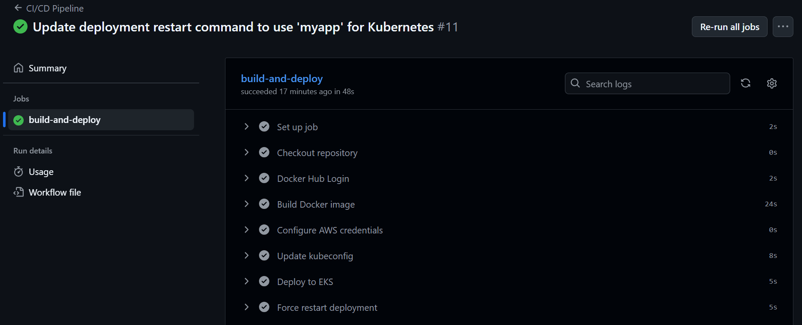
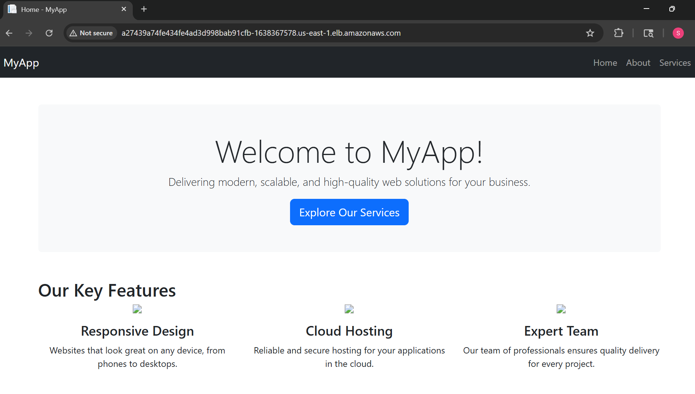
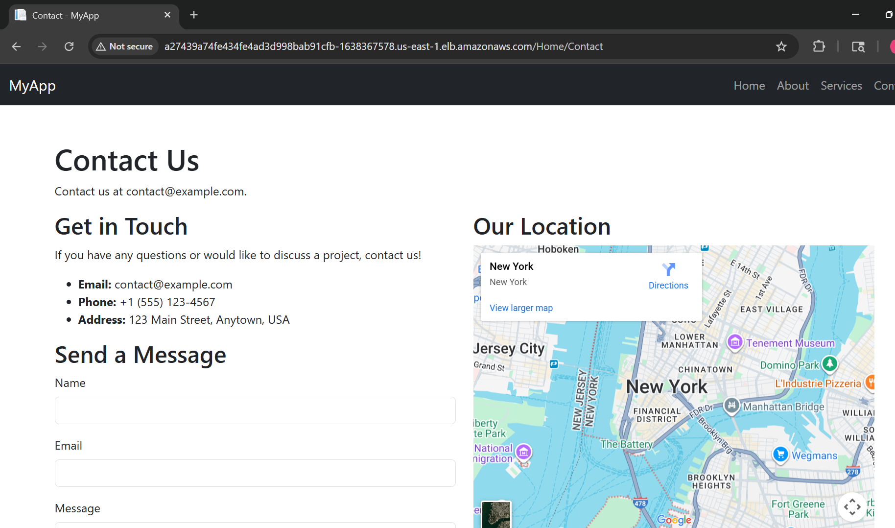

# .NET Web App on AWS EKS with Helm, Prometheus, and Grafana

This project demonstrates how to deploy a .NET web application on AWS EKS using Helm charts. It also integrates Prometheus for monitoring and Grafana for visualization.

## Prerequisites

- AWS account
- AWS CLI installed and configured
- kubectl installed
- Helm installed

## Setup Instructions
1. **Clone the Repository**:
   ```bash
   git clone https://github.com/yourusername/dotnet-helm-EKS.git
   ```

2. **Navigate to the Project Directory**:
   ```bash
   cd dotnet-helm-EKS
   ```

3. **Build the Docker Image**:
   ```bash
   docker build -t siri019/dotnetapp:latest ./WebApp
   ```

4. **Push the Docker Image to Docker Hub**:
   ```bash
   docker push siri019/dotnetapp:latest
   ```

5. **Create an EKS Cluster**:
   Use the AWS Management Console or AWS CLI to create an EKS cluster.

6. **Deploy the Application**:
   ```bash
   helm install myapp ./helm/myapp
   ```
7. **Access the Application**:
   Get the LoadBalancer URL from the service:
   ```bash
   kubectl get svc myapp
   ```
   Open your browser and navigate to `http://<LoadBalancer_IP>:<NodePort>`.
8. **Set Up Prometheus and Grafana**:
   Follow the instructions in the `prometheus` and `grafana` directories to deploy Prometheus and Grafana on your EKS cluster.

## AWS EKS Cluster Creation
You can create an EKS cluster using the AWS CLI:
```bash
eksctl create cluster \
  --name my-dotnet-cluster \
  --version 1.28 \
  --region us-east-1 \
  --nodegroup-name standard-workers \
  --node-type t3.medium \
  --nodes 2 \
  --nodes-min 2 \
  --nodes-max 4 \
  --managed

kubectl get nodes
```

## helm Chart Deployment
To deploy the Helm chart, use the following command:
```bash
helm install mydotnetapp ./mydotnetapp --set image.tag=latest --set image.pullPolicy=Always
```
To update the deployment with a new image, use:
```bash
helm upgrade --install mydotnetapp ./mydotnetapp --set image.tag=latest --set image.pullPolicy=Always
``` 
To force Kubernetes to pull the new image, use:
```bash
kubectl rollout restart deployment myapp
```

## Prometheus and Grafana Setup
1. **Deploy Prometheus**:
   ```bash
   helm install prometheus ./prometheus
   ```

2. **Deploy Grafana**:
   ```bash
   helm install grafana ./grafana
   ```
3. **Access Grafana**:
   Get the LoadBalancer URL from the Grafana service:
   ```bash
   kubectl get svc grafana
   ```
   Open your browser and navigate to `http://<Grafana_LoadBalancer_IP>:<NodePort>`.
   Default login credentials are:
   - Username: admin
   - Password: admin (you will be prompted to change it on first login)

## CI/CD with GitHub Actions
This project includes a GitHub Actions workflow for CI/CD. The workflow builds the Docker image, pushes it to Docker Hub, and deploys it to the EKS cluster on every push to the `main` branch.
Make sure to set the following secrets in your GitHub repository:
- `AWS_ACCESS_KEY_ID`
- `AWS_SECRET_ACCESS_KEY`
- `DOCKERHUB_USERNAME`
- `DOCKERHUB_PASSWORD`

## Demo and Screenshots
- When we commit and push the code to the main branch, the GitHub Actions workflow is triggered.
- The workflow builds the Docker image, pushes it to Docker Hub, and deploys it to the EKS cluster.
- Below are some screenshots of the deployed application.




- I added Contact page to the web app. Here is the screenshot of the Contact page, after the changes were applied.

