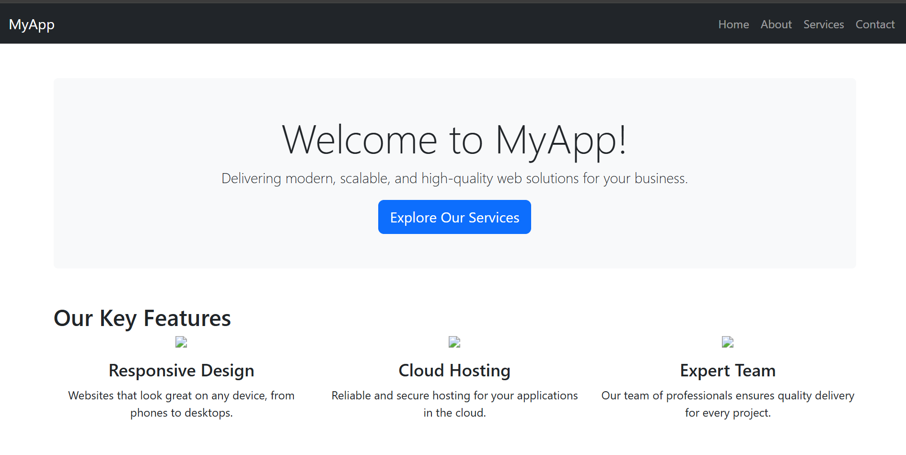
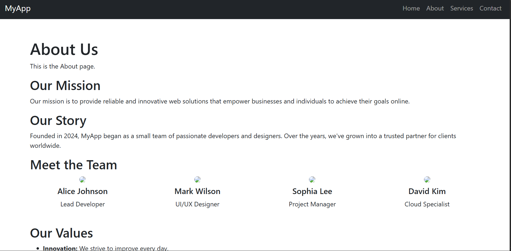
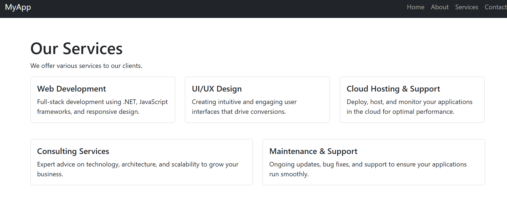

# Web Application

I created a simple .NET web application that serves as a demonstration for deploying on AWS EKS using Helm charts. The application includes basic routing and views.

For this project, I created 4 views: Home, About, Services, and Contact. Each view provides relevant information about the application and its features.

The Home view serves as the landing page, while the About view provides information about the application. The Services view outlines the services offered, and the Contact view includes a form for users to get in touch.

## Web Pages
- **Home**: The main landing page of the application.

- **About**: Information about the application.
  
- **Services**: Details about the services offered.

- **Contact**: A form for users to get in touch.
